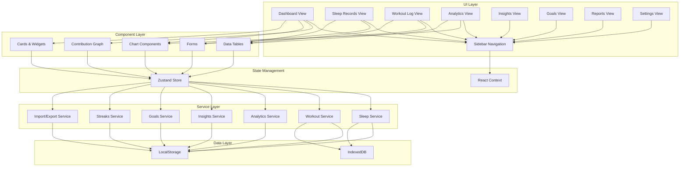
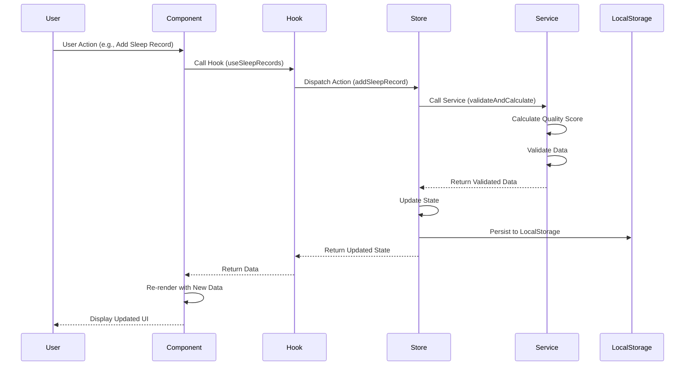
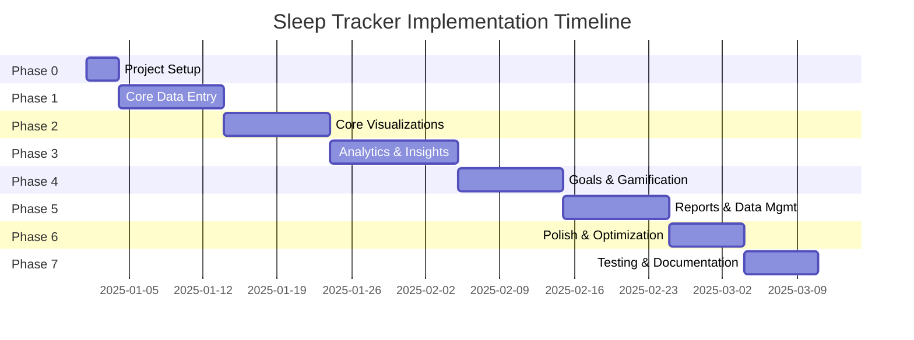

# Implementation Plan: Sleep Tracker Static Web Application

## Document Information

| Field | Value |
|-------|-------|
| Document Version | 1.0 |
| Date Created | 2025-12-29 |
| Author | Architect Team |
| Based On | PRD.md v1.0 |

---

## 1. Project Overview

### 1.1 Purpose

The Sleep Tracker is a static web application designed for fitness enthusiasts to monitor, analyze, and optimize their sleep patterns. The application enables users to correlate sleep quality with exercise performance and overall fitness goals through intuitive data visualization and personalized insights.

### 1.2 Key Value Propositions

- **Manual Data Entry Focus**: No external integrations required; users maintain full control over their data
- **Visual Analytics**: GitHub-style contribution graphs and rich dashboards for pattern identification
- **Personalized Insights**: AI-powered recommendations tailored to individual sleep patterns
- **Gamification**: Streak tracking and achievements to encourage consistent usage
- **Privacy-First**: Local storage with no cloud dependencies
- **Data Portability**: Full import/export capabilities for backup and analysis

### 1.3 Target Platform

- **Type**: Static Web Application (SPA - Single Page Application)
- **Deployment**: Can be hosted on any static hosting service (GitHub Pages, Netlify, Vercel, etc.)
- **Browser Support**: Modern browsers (Chrome, Firefox, Safari, Edge - last 2 versions)

---

## 2. Technology Stack Recommendations

### 2.1 Frontend Framework

**Recommendation: React 18+ with TypeScript**

**Rationale:**
- Component-based architecture aligns well with modular feature development
- Large ecosystem of charting libraries and UI components
- Strong TypeScript support for type safety
- Excellent developer tooling and community support
- Enables efficient state management for complex data interactions

**Alternatives Considered:**
- Vue.js 3: Simpler learning curve, smaller ecosystem
- Svelte: Better performance, smaller bundle size, but less mature ecosystem
- Vanilla JS: No build overhead, but harder to maintain at scale

### 2.2 Build Tool

**Recommendation: Vite**

**Rationale:**
- Fast development server with HMR
- Optimized production builds
- Native TypeScript support
- Plugin ecosystem for additional functionality
- Simpler configuration than Webpack

### 2.3 Charting Libraries

**Recommendation: Recharts + Custom Contribution Graph Component**

**Rationale:**
- **Recharts**: Built on React, composable components, excellent documentation
  - Line charts for sleep duration trends
  - Pie/Bar charts for sleep phase distribution
  - Scatter plots for bedtime/wake time patterns
  - Bar charts for weekly comparisons
- **Custom Component**: GitHub-style contribution graph
  - Use D3.js or pure CSS grid for the heatmap visualization
  - Better control over interactivity and styling

**Alternatives Considered:**
- Chart.js: More chart types, but less React-native feel
- ApexCharts: More features, but larger bundle size
- D3.js: Most flexible, but steeper learning curve

### 2.4 State Management

**Recommendation: Zustand + React Context API**

**Rationale:**
- **Zustand**: Lightweight, simple API, no boilerplate, excellent TypeScript support
  - Manage global state for sleep records, workouts, goals, streaks
  - Persist middleware for localStorage integration
- **React Context**: For theme, navigation, and UI state
  - Manage active view, sidebar state, modal states

**Alternatives Considered:**
- Redux Toolkit: More features, but overkill for this application
- Jotai: Atomic state, but more complex for beginners
- React Query: Great for server state, but this is a local-only app

### 2.5 Data Storage

**Recommendation: LocalStorage with IndexedDB as Backup**

**Rationale:**
- **LocalStorage**: Simple API, sufficient for text-based data
  - Store sleep records, workouts, goals, preferences
  - ~5-10MB limit (adequate for personal use)
- **IndexedDB**: For larger datasets if needed
  - Asynchronous operations
  - Larger storage capacity (~50MB+)
  - Better for complex queries

**Data Persistence Strategy:**
- Use Zustand persist middleware for automatic localStorage sync
- Implement backup/restore via JSON export/import
- Consider compression for large datasets

### 2.6 Date/Time Handling

**Recommendation: date-fns**

**Rationale:**
- Modular (tree-shakeable) - smaller bundle
- Immutable, pure functions
- Excellent TypeScript support
- Comprehensive documentation

**Alternatives Considered:**
- Day.js: Smaller, but fewer features
- Luxon: More features, but larger bundle
- Moment.js: Deprecated, not recommended

### 2.7 Form Handling

**Recommendation: React Hook Form + Zod**

**Rationale:**
- **React Hook Form**: Minimal re-renders, excellent performance
- **Zod**: TypeScript-first schema validation
- Seamless integration between form and validation

### 2.8 UI Component Library

**Recommendation: Tailwind CSS + Headless UI**

**Rationale:**
- **Tailwind CSS**: Utility-first, highly customizable, small bundle with JIT
- **Headless UI**: Accessible, unstyled components for complex UI patterns
- Custom components for specific needs (contribution graph, charts)

**Alternatives Considered:**
- Material-UI: More opinionated, larger bundle
- Chakra UI: Simpler, but less flexible
- shadcn/ui: Excellent choice, based on Radix UI and Tailwind

### 2.9 PDF Generation

**Recommendation: jsPDF + html2canvas**

**Rationale:**
- Generate reports as PDF for export
- html2canvas for capturing charts and visualizations
- Client-side only, no server required

### 2.10 Testing Framework

**Recommendation: Vitest + React Testing Library**

**Rationale:**
- **Vitest**: Fast, Jest-compatible, works with Vite
- **React Testing Library**: Encourages testing user behavior, not implementation
- Playwright for E2E testing

### 2.11 Type Checking

**Recommendation: TypeScript 5+**

**Rationale:**
- Catch errors at compile time
- Better IDE support and autocomplete
- Self-documenting code
- Essential for large codebases

### 2.12 Linting and Formatting

**Recommendation: ESLint + Prettier**

**Rationale:**
- **ESLint**: Code quality and consistency
- **Prettier**: Code formatting
- Pre-commit hooks with Husky for enforcement

---

## 3. Architecture Design

### 3.1 High-Level Architecture



### 3.2 Component Structure

```
src/
├── components/
│   ├── common/              # Shared UI components
│   │   ├── Button.tsx
│   │   ├── Card.tsx
│   │   ├── Input.tsx
│   │   ├── Select.tsx
│   │   ├── Modal.tsx
│   │   ├── Tooltip.tsx
│   │   └── ...
│   ├── layout/              # Layout components
│   │   ├── Sidebar.tsx
│   │   ├── Header.tsx
│   │   └── MainContent.tsx
│   ├── dashboard/           # Dashboard-specific components
│   │   ├── ContributionGraph.tsx
│   │   ├── QuickStats.tsx
│   │   ├── RecentActivity.tsx
│   │   └── StreakDisplay.tsx
│   ├── sleep/               # Sleep-related components
│   │   ├── SleepForm.tsx
│   │   ├── SleepList.tsx
│   │   ├── SleepCard.tsx
│   │   ├── MoodEnergyForm.tsx
│   │   └── QualityScore.tsx
│   ├── workout/             # Workout-related components
│   │   ├── WorkoutForm.tsx
│   │   ├── WorkoutList.tsx
│   │   ├── WorkoutCard.tsx
│   │   └── PerformanceMetrics.tsx
│   ├── analytics/           # Analytics components
│   │   ├── DurationChart.tsx
│   │   ├── PhaseChart.tsx
│   │   ├── EfficiencyChart.tsx
│   │   ├── ScheduleScatter.tsx
│   │   ├── WeeklyComparison.tsx
│   │   ├── CorrelationChart.tsx
│   │   └── DateRangePicker.tsx
│   ├── insights/            # Insights components
│   │   ├── InsightCard.tsx
│   │   ├── InsightList.tsx
│   │   ├── RecommendationCard.tsx
│   │   └── TrendAlert.tsx
│   ├── goals/               # Goals components
│   │   ├── GoalForm.tsx
│   │   ├── GoalList.tsx
│   │   ├── GoalProgress.tsx
│   │   └── GoalCard.tsx
│   ├── reports/             # Reports components
│   │   ├── WeeklyReport.tsx
│   │   ├── MonthlyReport.tsx
│   │   ├── ReportSummary.tsx
│   │   └── ReportExport.tsx
│   └── settings/            # Settings components
│       ├── PreferencesForm.tsx
│       ├── DataExport.tsx
│       ├── DataImport.tsx
│       └── DataManagement.tsx
├── stores/                  # Zustand stores
│   ├── sleepStore.ts
│   ├── workoutStore.ts
│   ├── moodEnergyStore.ts
│   ├── goalsStore.ts
│   ├── streaksStore.ts
│   ├── insightsStore.ts
│   └── preferencesStore.ts
├── services/                # Business logic
│   ├── sleepService.ts
│   ├── workoutService.ts
│   ├── analyticsService.ts
│   ├── insightsService.ts
│   ├── goalsService.ts
│   ├── streaksService.ts
│   ├── importExportService.ts
│   └── validationService.ts
├── utils/                   # Utility functions
│   ├── dateUtils.ts
│   ├── calculationUtils.ts
│   ├── formatUtils.ts
│   ├── constants.ts
│   └── validators.ts
├── types/                   # TypeScript types
│   ├── sleep.types.ts
│   ├── workout.types.ts
│   ├── moodEnergy.types.ts
│   ├── goals.types.ts
│   ├── insights.types.ts
│   └── common.types.ts
├── hooks/                   # Custom React hooks
│   ├── useSleepRecords.ts
│   ├── useWorkoutRecords.ts
│   ├── useAnalytics.ts
│   ├── useInsights.ts
│   ├── useGoals.ts
│   ├── useStreaks.ts
│   └── useLocalStorage.ts
├── context/                 # React Context
│   ├── ThemeContext.tsx
│   ├── NavigationContext.tsx
│   └── ModalContext.tsx
├── App.tsx
└── main.tsx
```

### 3.3 Data Flow



### 3.4 Module Organization

**Core Modules:**

1. **Data Entry Module**: Forms for sleep, workout, and mood/energy recording
2. **Data Management Module**: CRUD operations for all data types
3. **Analytics Module**: Charts, visualizations, and trend analysis
4. **Insights Module**: AI-powered insights and recommendations
5. **Goals Module**: Goal setting and progress tracking
6. **Streaks Module**: Gamification and consistency tracking
7. **Reports Module**: Weekly/monthly report generation
8. **Settings Module**: Preferences and data management

**Cross-Cutting Concerns:**

- **Validation**: Input validation across all forms
- **Persistence**: LocalStorage/IndexedDB integration
- **Export/Import**: Data portability features
- **Theming**: Consistent UI styling
- **Navigation**: View routing and state

---

## 4. Development Phases

### 4.1 Phase 0: Project Setup (Foundation)

**Duration**: Short sprint

**Deliverables:**
- Project initialized with Vite + React + TypeScript
- Development environment configured
- Basic folder structure created
- ESLint, Prettier, and Husky configured
- Tailwind CSS and shadcn/ui components installed
- Git repository initialized with .gitignore

**Tasks:**
- Initialize Vite project with React + TypeScript template
- Install and configure dependencies
- Set up folder structure
- Configure linting and formatting
- Set up pre-commit hooks
- Create base App component with routing placeholder

### 4.2 Phase 1: MVP - Core Data Entry and Storage

**Duration**: Medium sprint

**Deliverables:**
- Sleep data entry form with validation
- Workout data entry form with validation
- Mood/energy entry form
- LocalStorage persistence for all data types
- Basic list views for all records
- Edit and delete functionality

**Tasks:**
- Create data models and TypeScript types
- Implement Zustand stores for sleep, workout, and mood/energy data
- Build sleep entry form with React Hook Form + Zod
- Build workout entry form with React Hook Form + Zod
- Build mood/energy entry form
- Implement CRUD operations for all data types
- Create list views with filtering
- Add edit and delete functionality
- Implement localStorage persistence

### 4.3 Phase 2: Core Visualizations

**Duration**: Medium sprint

**Deliverables:**
- GitHub-style contribution graph
- Basic analytics dashboard with 3-4 key charts
- Sidebar navigation
- Dashboard overview page

**Tasks:**
- Build contribution graph component
- Implement date range picker
- Create sleep duration trend chart
- Create sleep phase distribution chart
- Create sleep efficiency chart
- Build sidebar navigation component
- Create dashboard overview with quick stats
- Implement view routing

### 4.4 Phase 3: Analytics and Insights

**Duration**: Medium sprint

**Deliverables:**
- Complete analytics dashboard with all charts
- Sleep quality scoring algorithm
- Basic insights generation
- Correlation analysis between sleep and workouts

**Tasks:**
- Implement sleep quality scoring algorithm
- Create bedtime/wake time scatter plot
- Create weekly comparison chart
- Create sleep-workout correlation chart
- Build insights service with pattern detection
- Create insights view with categorized insights
- Implement trend detection algorithms
- Add anomaly detection

### 4.5 Phase 4: Goals and Gamification

**Duration**: Medium sprint

**Deliverables:**
- Goal setting and tracking
- Streak tracking system
- Progress visualization
- Achievement celebrations

**Tasks:**
- Implement goals service
- Create goal entry form
- Build goal progress visualization
- Implement streak tracking algorithm
- Create streak display component
- Add milestone celebrations
- Build goals view with all goal types

### 4.6 Phase 5: Reports and Data Management

**Duration**: Medium sprint

**Deliverables:**
- Weekly and monthly report generation
- PDF export functionality
- Data export to JSON
- Data import from JSON
- Data backup and restore

**Tasks:**
- Implement report generation service
- Create weekly report view
- Create monthly report view
- Add PDF export functionality
- Implement JSON export
- Implement JSON import with validation
- Add data backup/restore functionality
- Add clear all data option

### 4.7 Phase 6: Polish and Optimization

**Duration**: Short sprint

**Deliverables:**
- Responsive design improvements
- Performance optimizations
- Accessibility improvements
- Error handling and edge cases
- User feedback and micro-interactions

**Tasks:**
- Improve responsive design for mobile
- Optimize chart rendering performance
- Add loading states
- Improve error messages
- Add success notifications
- Implement keyboard navigation
- Add ARIA labels
- Optimize bundle size

### 4.8 Phase 7: Testing and Documentation

**Duration**: Short sprint

**Deliverables:**
- Unit tests for critical functions
- Integration tests for key flows
- E2E tests for user journeys
- User documentation
- Developer documentation

**Tasks:**
- Write unit tests for algorithms
- Write integration tests for services
- Write E2E tests with Playwright
- Create README with setup instructions
- Document API/Service layer
- Create user guide
- Document deployment process

---

## 5. Component Breakdown

### 5.1 Common Components

| Component | Purpose | Props |
|-----------|---------|-------|
| `Button` | Reusable button with variants | `variant`, `size`, `disabled`, `onClick` |
| `Card` | Container component with consistent styling | `children`, `className`, `title` |
| `Input` | Text input with validation | `label`, `value`, `onChange`, `error` |
| `Select` | Dropdown selection | `label`, `options`, `value`, `onChange` |
| `Modal` | Modal dialog for forms and confirmations | `isOpen`, `onClose`, `children`, `title` |
| `Tooltip` | Hover tooltip for additional info | `content`, `children`, `position` |
| `DatePicker` | Date selection with calendar | `value`, `onChange`, `minDate`, `maxDate` |
| `Badge` | Status indicator | `variant`, `children` |
| `Progress` | Progress bar for goals | `value`, `max`, `label` |

### 5.2 Layout Components

| Component | Purpose | Props |
|-----------|---------|-------|
| `Sidebar` | Navigation menu | `activeView`, `onNavigate` |
| `Header` | Top bar with user info | `title`, `actions` |
| `MainContent` | Main content area wrapper | `children`, `className` |
| `Layout` | Overall page layout | `children` |

### 5.3 Dashboard Components

| Component | Purpose | Props |
|-----------|---------|-------|
| `ContributionGraph` | GitHub-style heatmap | `data`, `metric`, `dateRange`, `onDayClick` |
| `QuickStats` | Summary statistics cards | `stats` |
| `RecentActivity` | Recent records list | `records`, `type` |
| `StreakDisplay` | Current streaks overview | `streaks` |
| `SleepQualityOverview` | Quality score summary | `currentScore`, `trend` |

### 5.4 Sleep Components

| Component | Purpose | Props |
|-----------|---------|-------|
| `SleepForm` | Add/edit sleep record | `initialValues`, `onSubmit`, `onCancel` |
| `SleepList` | List of sleep records | `records`, `onEdit`, `onDelete` |
| `SleepCard` | Single sleep record display | `record`, `onEdit`, `onDelete` |
| `MoodEnergyForm` | Mood and energy entry | `initialValues`, `onSubmit` |
| `QualityScore` | Quality score display with breakdown | `score`, `breakdown` |
| `SleepPhaseInput` | Sleep phase duration input | `phases`, `onChange` |

### 5.5 Workout Components

| Component | Purpose | Props |
|-----------|---------|-------|
| `WorkoutForm` | Add/edit workout record | `initialValues`, `onSubmit`, `onCancel` |
| `WorkoutList` | List of workout records | `records`, `onEdit`, `onDelete` |
| `WorkoutCard` | Single workout record display | `record`, `onEdit`, `onDelete` |
| `PerformanceMetrics` | Performance metrics display | `metrics`, `workoutType` |
| `IntensitySelector` | Intensity level selection | `value`, `onChange` |

### 5.6 Analytics Components

| Component | Purpose | Props |
|-----------|---------|-------|
| `DurationChart` | Sleep duration trend line chart | `data`, `dateRange` |
| `PhaseChart` | Sleep phase distribution | `data` |
| `EfficiencyChart` | Sleep efficiency over time | `data`, `dateRange` |
| `ScheduleScatter` | Bedtime/wake time scatter plot | `data` |
| `WeeklyComparison` | Day of week comparison | `data` |
| `CorrelationChart` | Sleep vs workout correlation | `sleepData`, `workoutData` |
| `DateRangePicker` | Date range selection | `value`, `onChange`, `presets` |
| `ChartContainer` | Chart wrapper with export | `children`, `title`, `onExport` |

### 5.7 Insights Components

| Component | Purpose | Props |
|-----------|---------|-------|
| `InsightCard` | Single insight display | `insight`, `onRead`, `onDismiss` |
| `InsightList` | List of insights with filters | `insights`, `filter`, `onFilter` |
| `RecommendationCard` | Recommendation with action | `recommendation`, `onImplement` |
| `TrendAlert` | Alert for concerning trends | `alert`, `onAcknowledge` |
| `InsightCategory` | Category header for insights | `category`, `count` |

### 5.8 Goals Components

| Component | Purpose | Props |
|-----------|---------|-------|
| `GoalForm` | Add/edit goal | `initialValues`, `onSubmit`, `onCancel` |
| `GoalList` | List of goals | `goals`, `onEdit`, `onDelete` |
| `GoalProgress` | Progress visualization | `goal`, `progress` |
| `GoalCard` | Single goal with progress | `goal`, `onEdit`, `onDelete` |
| `GoalTypeSelector` | Goal type selection | `value`, `onChange` |
| `GoalAchievement` | Celebration for achieved goals | `goal` |

### 5.9 Reports Components

| Component | Purpose | Props |
|-----------|---------|-------|
| `WeeklyReport` | Weekly summary report | `weekData`, `previousWeekData` |
| `MonthlyReport` | Monthly summary report | `monthData`, `previousMonthData` |
| `ReportSummary` | Key metrics summary | `metrics` |
| `ReportExport` | Export options and actions | `report`, `onExport` |
| `ReportPeriodSelector` | Period selection | `value`, `onChange`, `type` |

### 5.10 Settings Components

| Component | Purpose | Props |
|-----------|---------|-------|
| `PreferencesForm` | User preferences | `preferences`, `onSave` |
| `DataExport` | Export options and actions | `onExport` |
| `DataImport` | Import with preview | `onImport` |
| `DataManagement` | Data operations | `onClear`, `onBackup`, `onRestore` |

---

## 6. Data Model Design

### 6.1 Sleep Record Model

```typescript
interface SleepRecord {
  id: string;                    // Unique identifier (UUID)
  date: string;                  // ISO date string (YYYY-MM-DD)
  bedtime: string;               // ISO datetime string
  wakeTime: string;              // ISO datetime string
  duration: number;              // Duration in minutes (calculated)
  deepSleep: number;             // Deep sleep duration in minutes
  remSleep: number;              // REM sleep duration in minutes
  lightSleep: number;            // Light sleep duration in minutes
  efficiency: number;            // Efficiency percentage (0-100)
  qualityScore: number;          // Calculated quality score (0-100)
  notes?: string;                // Optional notes
  createdAt: string;             // ISO timestamp
  updatedAt: string;             // ISO timestamp
}

interface SleepRecordInput {
  date: string;
  bedtime: string;
  wakeTime: string;
  deepSleep?: number;
  remSleep?: number;
  lightSleep?: number;
  efficiency?: number;
  notes?: string;
}
```

### 6.2 Workout Record Model

```typescript
interface WorkoutRecord {
  id: string;                    // Unique identifier (UUID)
  date: string;                  // ISO date string (YYYY-MM-DD)
  time: string;                  // ISO datetime string
  type: WorkoutType;             // Enum: running, cycling, swimming, etc.
  duration: number;              // Duration in minutes
  intensity: IntensityLevel;      // Enum: low, medium, high
  performanceMetrics: PerformanceMetrics; // Variable based on type
  perceivedExertion: number;     // 1-10 scale
  energyLevel: number;           // 1-5 scale
  notes?: string;                // Optional notes
  createdAt: string;             // ISO timestamp
  updatedAt: string;             // ISO timestamp
}

type WorkoutType = 
  | 'running' 
  | 'cycling' 
  | 'swimming' 
  | 'weightlifting' 
  | 'yoga' 
  | 'hiit' 
  | 'crossfit' 
  | 'other';

type IntensityLevel = 'low' | 'medium' | 'high';

interface PerformanceMetrics {
  distance?: number;             // km/miles (for cardio)
  weight?: number;              // kg/lbs (for strength)
  reps?: number;                // repetitions
  sets?: number;                 // sets
  pace?: number;                 // min/km or min/mile
  calories?: number;            // calories burned
}

interface WorkoutRecordInput {
  date: string;
  time: string;
  type: WorkoutType;
  duration: number;
  intensity: IntensityLevel;
  performanceMetrics?: Partial<PerformanceMetrics>;
  perceivedExertion: number;
  energyLevel: number;
  notes?: string;
}
```

### 6.3 Mood and Energy Model

```typescript
interface MoodEnergyRecord {
  id: string;                    // Unique identifier (UUID)
  date: string;                  // ISO date string (YYYY-MM-DD)
  mood: MoodRating;              // 1-5 scale
  morningEnergy: number;         // 1-5 scale
  afternoonEnergy: number;       // 1-5 scale
  eveningEnergy: number;         // 1-5 scale
  notes?: string;                // Optional notes
  createdAt: string;             // ISO timestamp
  updatedAt: string;             // ISO timestamp
}

type MoodRating = 1 | 2 | 3 | 4 | 5;

const MoodLabels: Record<MoodRating, string> = {
  1: 'Very Poor',
  2: 'Poor',
  3: 'Fair',
  4: 'Good',
  5: 'Excellent'
};

interface MoodEnergyInput {
  date: string;
  mood: MoodRating;
  morningEnergy: number;
  afternoonEnergy: number;
  eveningEnergy: number;
  notes?: string;
}
```

### 6.4 Goal Model

```typescript
interface Goal {
  id: string;                    // Unique identifier (UUID)
  type: GoalType;                // Goal type
  targetValue: GoalTarget;       // Target value (varies by type)
  startDate: string;             // ISO date string
  status: GoalStatus;            // Current status
  progress: GoalProgress;        // Progress tracking
  createdAt: string;             // ISO timestamp
  updatedAt: string;             // ISO timestamp
}

type GoalType = 'duration' | 'bedtime' | 'quality' | 'consistency';

type GoalTarget = 
  | { type: 'duration'; hours: number }
  | { type: 'bedtime'; start: string; end: string } // HH:MM format
  | { type: 'quality'; score: number }
  | { type: 'consistency'; nightsPerWeek: number };

type GoalStatus = 'active' | 'achieved' | 'paused' | 'discontinued';

interface GoalProgress {
  currentStreak: number;         // Current consecutive days
  totalDaysMet: number;          // Total days goal was met
  completionPercentage: number;  // 0-100
  lastUpdated: string;           // ISO timestamp
}

interface GoalInput {
  type: GoalType;
  targetValue: GoalTarget;
  startDate: string;
}
```

### 6.5 Streak Model

```typescript
interface Streaks {
  logging: Streak;               // Consecutive days of logging
  duration: Streak;              // Consecutive days meeting duration goal
  bedtime: Streak;               // Consecutive days meeting bedtime goal
  quality: Streak;               // Consecutive days meeting quality goal
}

interface Streak {
  current: number;               // Current streak count
  personalBest: number;          // Personal best streak
  personalBestDate: string;      // Date personal best was achieved
  lastUpdated: string;           // ISO timestamp
}
```

### 6.6 Insight Model

```typescript
interface Insight {
  id: string;                    // Unique identifier (UUID)
  type: InsightType;             // Type of insight
  category: InsightCategory;     // Category for filtering
  title: string;                 // Short description
  description: string;           // Detailed explanation
  priority: InsightPriority;    // Priority level
  data?: any;                    // Associated data (charts, metrics)
  isRead: boolean;               // Read status
  isDismissed: boolean;          // Dismissed status
  createdAt: string;             // ISO timestamp
}

type InsightType = 
  | 'trend' 
  | 'anomaly' 
  | 'correlation' 
  | 'recommendation' 
  | 'alert';

type InsightCategory = 
  | 'duration' 
  | 'efficiency' 
  | 'phases' 
  | 'consistency' 
  | 'performance';

type InsightPriority = 'high' | 'medium' | 'low';

interface Recommendation extends Insight {
  type: 'recommendation';
  implemented: boolean;          // Whether user implemented
  impact?: number;               // Measured impact (optional)
}
```

### 6.7 User Preferences Model

```typescript
interface UserPreferences {
  units: UnitSystem;              // Metric or Imperial
  timeZone: string;              // IANA time zone
  defaultBedtimeTarget: string;  // HH:MM format
  defaultWakeTimeTarget: string; // HH:MM format
  defaultDurationTarget: number; // Hours
  defaultQualityTarget: number; // 0-100
  theme: Theme;                  // Light or Dark
  notificationsEnabled: boolean; // For future use
}

type UnitSystem = 'metric' | 'imperial';
type Theme = 'light' | 'dark' | 'system';
```

### 6.8 Export/Import Model

```typescript
interface ExportData {
  version: string;               // Application version
  exportDate: string;            // ISO timestamp
  sleepRecords: SleepRecord[];
  workoutRecords: WorkoutRecord[];
  moodEnergyRecords: MoodEnergyRecord[];
  goals: Goal[];
  preferences: UserPreferences;
}

interface ImportOptions {
  mergeStrategy: MergeStrategy;  // How to handle conflicts
  skipValidation: boolean;       // Skip validation (not recommended)
}

type MergeStrategy = 'merge' | 'replace' | 'skip';
```

---

## 7. API/Service Layer Design

### 7.1 Sleep Service

```typescript
class SleepService {
  // CRUD Operations
  createSleepRecord(input: SleepRecordInput): SleepRecord;
  updateSleepRecord(id: string, input: Partial<SleepRecordInput>): SleepRecord;
  deleteSleepRecord(id: string): void;
  getSleepRecord(id: string): SleepRecord | undefined;
  getSleepRecords(filters?: SleepFilters): SleepRecord[];
  
  // Query Operations
  getSleepRecordsByDateRange(startDate: string, endDate: string): SleepRecord[];
  getSleepRecordsByDate(date: string): SleepRecord | undefined;
  getLatestSleepRecord(): SleepRecord | undefined;
  
  // Calculations
  calculateDuration(bedtime: string, wakeTime: string): number;
  calculateQualityScore(record: SleepRecordInput): number;
  validateSleepPhases(totalDuration: number, phases: SleepPhases): boolean;
  
  // Statistics
  getAverageDuration(records: SleepRecord[]): number;
  getAverageEfficiency(records: SleepRecord[]): number;
  getAverageQualityScore(records: SleepRecord[]): number;
  getSleepConsistency(records: SleepRecord[]): number;
}

interface SleepFilters {
  startDate?: string;
  endDate?: string;
  minQualityScore?: number;
  maxQualityScore?: number;
  minDuration?: number;
  maxDuration?: number;
}

interface SleepPhases {
  deepSleep: number;
  remSleep: number;
  lightSleep: number;
}
```

### 7.2 Workout Service

```typescript
class WorkoutService {
  // CRUD Operations
  createWorkoutRecord(input: WorkoutRecordInput): WorkoutRecord;
  updateWorkoutRecord(id: string, input: Partial<WorkoutRecordInput>): WorkoutRecord;
  deleteWorkoutRecord(id: string): void;
  getWorkoutRecord(id: string): WorkoutRecord | undefined;
  getWorkoutRecords(filters?: WorkoutFilters): WorkoutRecord[];
  
  // Query Operations
  getWorkoutsByDateRange(startDate: string, endDate: string): WorkoutRecord[];
  getWorkoutsByType(type: WorkoutType): WorkoutRecord[];
  getWorkoutsByDate(date: string): WorkoutRecord[];
  
  // Statistics
  getTotalDuration(records: WorkoutRecord[]): number;
  getAverageDuration(records: WorkoutRecord[]): number;
  getAverageIntensity(records: WorkoutRecord[]): IntensityLevel;
  getWorkoutFrequency(records: WorkoutRecord[]): number; // workouts per week
  
  // Performance Analysis
  getPerformanceTrend(type: WorkoutType, metric: keyof PerformanceMetrics): TrendData;
  getBestPerformance(type: WorkoutType, metric: keyof PerformanceMetrics): WorkoutRecord;
}

interface WorkoutFilters {
  startDate?: string;
  endDate?: string;
  type?: WorkoutType;
  intensity?: IntensityLevel;
}

interface TrendData {
  dates: string[];
  values: number[];
  trend: 'improving' | 'declining' | 'stable';
}
```

### 7.3 Analytics Service

```typescript
class AnalyticsService {
  // Sleep Analytics
  getSleepDurationTrend(records: SleepRecord[], period: TimePeriod): TrendData;
  getSleepPhaseDistribution(records: SleepRecord[]): PhaseDistribution;
  getSleepEfficiencyTrend(records: SleepRecord[], period: TimePeriod): TrendData;
  getBedtimeWakeTimePatterns(records: SleepRecord[]): SchedulePattern;
  getWeeklySleepComparison(records: SleepRecord[]): WeeklyComparison;
  
  // Correlation Analysis
  getSleepWorkoutCorrelation(sleepRecords: SleepRecord[], workoutRecords: WorkoutRecord[]): CorrelationData;
  getSleepMoodCorrelation(sleepRecords: SleepRecord[], moodRecords: MoodEnergyRecord[]): CorrelationData;
  getSleepEnergyCorrelation(sleepRecords: SleepRecord[], moodRecords: MoodEnergyRecord[]): CorrelationData;
  
  // Advanced Analytics
  getSleepConsistencyScore(records: SleepRecord[]): number;
  getSleepRecoveryScore(sleepRecord: SleepRecord, previousWorkouts: WorkoutRecord[]): number;
  getOptimalSleepPattern(records: SleepRecord[], metric: string): PatternAnalysis;
  
  // Trend Analysis
  detectTrend(data: number[]): TrendDirection;
  calculateMovingAverage(data: number[], window: number): number[];
  detectSeasonality(records: SleepRecord[]): SeasonalityData;
}

type TimePeriod = 'daily' | 'weekly' | 'monthly';

interface PhaseDistribution {
  deepSleep: number;    // percentage
  remSleep: number;    // percentage
  lightSleep: number;  // percentage
}

interface SchedulePattern {
  averageBedtime: string;
  averageWakeTime: string;
  bedtimeVariance: number; // standard deviation in minutes
  wakeTimeVariance: number;
  mostCommonBedtime: string;
  mostCommonWakeTime: string;
}

interface WeeklyComparison {
  monday: DailyStats;
  tuesday: DailyStats;
  wednesday: DailyStats;
  thursday: DailyStats;
  friday: DailyStats;
  saturday: DailyStats;
  sunday: DailyStats;
}

interface DailyStats {
  averageDuration: number;
  averageEfficiency: number;
  averageQuality: number;
  recordCount: number;
}

interface CorrelationData {
  correlation: number; // -1 to 1
  strength: 'strong' | 'moderate' | 'weak' | 'none';
  dataPoints: Array<{ x: number; y: number; date: string }>;
  interpretation: string;
}

type TrendDirection = 'increasing' | 'decreasing' | 'stable';

interface PatternAnalysis {
  optimalBedtime: string;
  optimalWakeTime: string;
  optimalDuration: number;
  confidence: number; // 0-1
}

interface SeasonalityData {
  weekdayAverage: number;
  weekendAverage: number;
  difference: number;
  significance: 'significant' | 'moderate' | 'minimal';
}
```

### 7.4 Insights Service

```typescript
class InsightsService {
  // Insight Generation
  generateAllInsights(sleepRecords: SleepRecord[], workoutRecords?: WorkoutRecord[], moodRecords?: MoodEnergyRecord[]): Insight[];
  generateTrendInsights(sleepRecords: SleepRecord[]): Insight[];
  generateAnomalyInsights(sleepRecords: SleepRecord[]): Insight[];
  generateCorrelationInsights(sleepRecords: SleepRecord[], workoutRecords: WorkoutRecord[], moodRecords: MoodEnergyRecord[]): Insight[];
  generateRecommendations(sleepRecords: SleepRecord[]): Recommendation[];
  generateAlerts(sleepRecords: SleepRecord[]): Insight[];
  
  // Insight Management
  markAsRead(id: string): void;
  markAsDismissed(id: string): void;
  markAsImplemented(id: string): void;
  trackRecommendationImpact(id: string, impact: number): void;
  
  // Filtering
  filterByCategory(insights: Insight[], category: InsightCategory): Insight[];
  filterByPriority(insights: Insight[], priority: InsightPriority): Insight[];
  filterByType(insights: Insight[], type: InsightType): Insight[];
  
  // Analytics for Insights
  getInsightRelevanceScore(insight: Insight, userData: UserData): number;
  updateInsightBasedOnFeedback(insightId: string, feedback: Feedback): void;
}

interface UserData {
  averageSleepDuration: number;
  averageSleepQuality: number;
  goals: Goal[];
  preferences: UserPreferences;
}

interface Feedback {
  helpful: boolean;
  implemented: boolean;
  rating?: number; // 1-5
}
```

### 7.5 Goals Service

```typescript
class GoalsService {
  // CRUD Operations
  createGoal(input: GoalInput): Goal;
  updateGoal(id: string, updates: Partial<GoalInput>): Goal;
  deleteGoal(id: string): void;
  getGoal(id: string): Goal | undefined;
  getAllGoals(): Goal[];
  getActiveGoals(): Goal[];
  
  // Progress Tracking
  updateGoalProgress(goal: Goal, sleepRecords: SleepRecord[]): GoalProgress;
  checkGoalAchievement(goal: Goal): boolean;
  getGoalCompletionPercentage(goal: Goal): number;
  
  // Goal Types
  checkDurationGoal(goal: Goal, sleepRecord: SleepRecord): boolean;
  checkBedtimeGoal(goal: Goal, sleepRecord: SleepRecord): boolean;
  checkQualityGoal(goal: Goal, sleepRecord: SleepRecord): boolean;
  checkConsistencyGoal(goal: Goal, sleepRecords: SleepRecord[]): boolean;
  
  // Statistics
  getGoalsAchievedCount(): number;
  getGoalsInProgressCount(): number;
  getAverageGoalCompletion(): number;
}
```

### 7.6 Streaks Service

```typescript
class StreaksService {
  // Streak Calculation
  calculateLoggingStreak(sleepRecords: SleepRecord[]): number;
  calculateDurationStreak(sleepRecords: SleepRecord[], targetDuration: number): number;
  calculateBedtimeStreak(sleepRecords: SleepRecord[], targetBedtime: string, tolerance: number): number;
  calculateQualityStreak(sleepRecords: SleepRecord[], targetQuality: number): number;
  
  // Streak Management
  updateAllStreaks(sleepRecords: SleepRecord[], goals: Goal[]): Streaks;
  checkPersonalBest(streakType: keyof Streaks, currentStreak: number): boolean;
  recordPersonalBest(streakType: keyof Streaks, streak: number): void;
  
  // Streak History
  getStreakHistory(streakType: keyof Streaks): StreakHistoryEntry[];
  getLongestStreak(streakType: keyof Streaks): number;
  
  // Milestones
  checkMilestone(streak: number): boolean;
  getNextMilestone(currentStreak: number): number;
}

interface StreakHistoryEntry {
  date: string;
  streak: number;
  isPersonalBest: boolean;
}
```

### 7.7 Import/Export Service

```typescript
class ImportExportService {
  // Export Operations
  exportAllData(): ExportData;
  exportFilteredData(filters: ExportFilters): ExportData;
  exportToJSON(data: ExportData): string;
  downloadAsFile(content: string, filename: string): void;
  
  // Import Operations
  importFromJSON(jsonString: string): ImportResult;
  importFromFile(file: File): Promise<ImportResult>;
  validateImportData(data: any): ValidationResult;
  mergeImportedData(importedData: ExportData, options: ImportOptions): MergeResult;
  
  // Backup Operations
  createBackup(): ExportData;
  restoreBackup(data: ExportData): RestoreResult;
  clearAllData(): void;
}

interface ExportFilters {
  startDate?: string;
  endDate?: string;
  includeSleep?: boolean;
  includeWorkouts?: boolean;
  includeMood?: boolean;
  includeGoals?: boolean;
}

interface ImportResult {
  success: boolean;
  recordsImported: number;
  recordsSkipped: number;
  errors: string[];
}

interface ValidationResult {
  isValid: boolean;
  errors: ValidationError[];
}

interface ValidationError {
  field: string;
  message: string;
  severity: 'error' | 'warning';
}

interface MergeResult {
  sleepRecordsAdded: number;
  sleepRecordsUpdated: number;
  workoutRecordsAdded: number;
  workoutRecordsUpdated: number;
  conflicts: Conflict[];
}

interface Conflict {
  type: 'sleep' | 'workout' | 'mood' | 'goal';
  id: string;
  existingData: any;
  importedData: any;
}

interface RestoreResult {
  success: boolean;
  recordsRestored: number;
  errors: string[];
}
```

### 7.8 Validation Service

```typescript
class ValidationService {
  // Sleep Validation
  validateSleepRecord(input: SleepRecordInput): ValidationResult;
  validateBedtimeWakeTime(bedtime: string, wakeTime: string): ValidationResult;
  validateSleepPhases(phases: SleepPhases, totalDuration: number): ValidationResult;
  validateSleepEfficiency(efficiency: number): ValidationResult;
  
  // Workout Validation
  validateWorkoutRecord(input: WorkoutRecordInput): ValidationResult;
  validateDuration(duration: number): ValidationResult;
  validatePerceivedExertion(exertion: number): ValidationResult;
  validateEnergyLevel(energy: number): ValidationResult;
  
  // Mood/Energy Validation
  validateMoodEnergyRecord(input: MoodEnergyInput): ValidationResult;
  validateMoodRating(mood: MoodRating): ValidationResult;
  validateEnergyLevel(energy: number): ValidationResult;
  
  // Goal Validation
  validateGoalInput(input: GoalInput): ValidationResult;
  validateDurationTarget(hours: number): ValidationResult;
  validateBedtimeTarget(bedtime: string): ValidationResult;
  validateQualityTarget(score: number): ValidationResult;
  validateConsistencyTarget(nights: number): ValidationResult;
  
  // Common Validation
  validateDate(date: string): ValidationResult;
  validateEmail(email: string): ValidationResult;
  validateRequired(value: any, fieldName: string): ValidationResult;
}
```

---

## 8. Key Algorithms

### 8.1 Sleep Quality Scoring Algorithm

**Purpose**: Calculate a daily sleep quality score (0-100) based on multiple factors.

**Algorithm**:

```typescript
function calculateSleepQualityScore(record: SleepRecordInput): number {
  // 1. Duration Score (0-40 points)
  const optimalDuration = 8 * 60; // 8 hours in minutes
  const minDuration = 6 * 60;    // 6 hours
  const maxDuration = 10 * 60;   // 10 hours
  
  let durationScore = 0;
  if (record.duration >= minDuration && record.duration <= maxDuration) {
    // Linear interpolation from min to optimal
    if (record.duration <= optimalDuration) {
      durationScore = ((record.duration - minDuration) / (optimalDuration - minDuration)) * 40;
    } else {
      // Diminishing returns beyond optimal
      durationScore = 40 - ((record.duration - optimalDuration) / (maxDuration - optimalDuration)) * 10;
    }
  }
  
  // 2. Efficiency Score (0-30 points)
  const efficiencyScore = (record.efficiency || 85) * 0.3;
  
  // 3. Sleep Phase Balance Score (0-20 points)
  const phaseScore = calculatePhaseScore(record);
  
  // 4. Consistency Score (0-10 points)
  const consistencyScore = calculateConsistencyScore(record);
  
  // Total Score
  const totalScore = Math.round(
    durationScore + efficiencyScore + phaseScore + consistencyScore
  );
  
  return Math.max(0, Math.min(100, totalScore));
}

function calculatePhaseScore(record: SleepRecordInput): number {
  const total = record.duration;
  if (!total || total === 0) return 0;
  
  const deepSleep = record.deepSleep || 0;
  const remSleep = record.remSleep || 0;
  
  // Optimal percentages
  const optimalDeepPercent = 0.20; // 20%
  const optimalRemPercent = 0.25;  // 25%
  
  const actualDeepPercent = deepSleep / total;
  const actualRemPercent = remSleep / total;
  
  // Calculate deviation from optimal
  const deepDeviation = Math.abs(actualDeepPercent - optimalDeepPercent);
  const remDeviation = Math.abs(actualRemPercent - optimalRemPercent);
  
  // Score based on deviation (lower deviation = higher score)
  const deepScore = Math.max(0, 10 - deepDeviation * 50);
  const remScore = Math.max(0, 10 - remDeviation * 40);
  
  return deepScore + remScore;
}

function calculateConsistencyScore(record: SleepRecordInput): number {
  // This would compare to user's historical average
  // For initial implementation, return a baseline score
  return 7; // Base score for consistency
}
```

**Quality Score Categories**:
- 80-100: Excellent (green)
- 60-79: Good (blue)
- 40-59: Fair (yellow)
- 0-39: Poor (red)

### 8.2 Streak Tracking Algorithm

**Purpose**: Track consecutive days of meeting specific criteria.

**Algorithm**:

```typescript
function calculateStreak(
  records: any[],
  dateField: string,
  checkFunction: (record: any) => boolean
): number {
  if (records.length === 0) return 0;
  
  // Sort records by date descending
  const sortedRecords = [...records].sort((a, b) => 
    new Date(b[dateField]).getTime() - new Date(a[dateField]).getTime()
  );
  
  let streak = 0;
  let currentDate = new Date();
  currentDate.setHours(0, 0, 0, 0);
  
  for (const record of sortedRecords) {
    const recordDate = new Date(record[dateField]);
    recordDate.setHours(0, 0, 0, 0);
    
    // Check if record is from today or yesterday (continuing streak)
    const daysDiff = Math.floor(
      (currentDate.getTime() - recordDate.getTime()) / (1000 * 60 * 60 * 24)
    );
    
    if (daysDiff === streak && checkFunction(record)) {
      streak++;
      currentDate = recordDate;
    } else if (daysDiff > streak) {
      // Gap found, streak broken
      break;
    }
    // If daysDiff < streak, we've seen this date before (multiple records)
  }
  
  return streak;
}

// Example: Duration Streak
function calculateDurationStreak(
  sleepRecords: SleepRecord[],
  targetDuration: number
): number {
  return calculateStreak(
    sleepRecords,
    'date',
    (record) => record.duration >= targetDuration * 60 // Convert hours to minutes
  );
}

// Example: Bedtime Streak
function calculateBedtimeStreak(
  sleepRecords: SleepRecord[],
  targetBedtime: string,
  toleranceMinutes: number = 30
): number {
  const [targetHour, targetMinute] = targetBedtime.split(':').map(Number);
  const targetTime = targetHour * 60 + targetMinute;
  
  return calculateStreak(
    sleepRecords,
    'date',
    (record) => {
      const bedtime = new Date(record.bedtime);
      const recordTime = bedtime.getHours() * 60 + bedtime.getMinutes();
      return Math.abs(recordTime - targetTime) <= toleranceMinutes;
    }
  );
}
```

### 8.3 Insight Generation Algorithm

**Purpose**: Generate personalized insights based on user data patterns.

**Algorithm**:

```typescript
function generateTrendInsights(sleepRecords: SleepRecord[]): Insight[] {
  const insights: Insight[] = [];
  
  if (sleepRecords.length < 7) return insights;
  
  // 1. Duration Trend
  const durationTrend = analyzeTrend(
    sleepRecords.map(r => r.duration),
    sleepRecords.map(r => r.date)
  );
  
  if (durationTrend.direction === 'decreasing' && durationTrend.significance > 0.7) {
    insights.push({
      id: generateId(),
      type: 'trend',
      category: 'duration',
      title: 'Declining Sleep Duration',
      description: `Your sleep duration has been decreasing over the past ${durationTrend.period}. Average duration has dropped from ${durationTrend.startValue} to ${durationTrend.endValue} hours.`,
      priority: 'high',
      data: durationTrend,
      isRead: false,
      isDismissed: false,
      createdAt: new Date().toISOString()
    });
  }
  
  // 2. Quality Trend
  const qualityTrend = analyzeTrend(
    sleepRecords.map(r => r.qualityScore),
    sleepRecords.map(r => r.date)
  );
  
  if (qualityTrend.direction === 'improving' && qualityTrend.significance > 0.6) {
    insights.push({
      id: generateId(),
      type: 'trend',
      category: 'efficiency',
      title: 'Improving Sleep Quality',
      description: `Great job! Your sleep quality has been improving over the past ${qualityTrend.period}. Keep up the good work!`,
      priority: 'medium',
      data: qualityTrend,
      isRead: false,
      isDismissed: false,
      createdAt: new Date().toISOString()
    });
  }
  
  return insights;
}

function analyzeTrend(values: number[], dates: string[]): TrendAnalysis {
  if (values.length < 2) {
    return { direction: 'stable', significance: 0, period: 'week' };
  }
  
  // Calculate linear regression
  const n = values.length;
  const sumX = values.reduce((sum, _, i) => sum + i, 0);
  const sumY = values.reduce((sum, val) => sum + val, 0);
  const sumXY = values.reduce((sum, val, i) => sum + i * val, 0);
  const sumX2 = values.reduce((sum, _, i) => sum + i * i, 0);
  
  const slope = (n * sumXY - sumX * sumY) / (n * sumX2 - sumX * sumX);
  
  // Calculate R-squared for significance
  const meanY = sumY / n;
  const ssTotal = values.reduce((sum, val) => sum + Math.pow(val - meanY, 2), 0);
  const ssResidual = values.reduce((sum, val, i) => {
    const predicted = (slope * i) + (sumY - slope * sumX) / n;
    return sum + Math.pow(val - predicted, 2);
  }, 0);
  const rSquared = 1 - (ssResidual / ssTotal);
  
  // Determine direction
  let direction: 'increasing' | 'decreasing' | 'stable';
  if (Math.abs(slope) < 0.1) {
    direction = 'stable';
  } else if (slope > 0) {
    direction = 'increasing';
  } else {
    direction = 'decreasing';
  }
  
  // Determine period
  const dateRange = Math.floor(
    (new Date(dates[dates.length - 1]).getTime() - new Date(dates[0]).getTime()) 
    / (1000 * 60 * 60 * 24)
  );
  let period = 'week';
  if (dateRange > 30) period = 'month';
  else if (dateRange > 7) period = 'weeks';
  
  return {
    direction,
    significance: rSquared,
    period,
    startValue: values[0],
    endValue: values[values.length - 1],
    slope
  };
}

interface TrendAnalysis {
  direction: 'increasing' | 'decreasing' | 'stable';
  significance: number; // 0-1
  period: string;
  startValue: number;
  endValue: number;
  slope?: number;
}
```

### 8.4 Correlation Analysis Algorithm

**Purpose**: Identify relationships between sleep metrics and other variables.

**Algorithm**:

```typescript
function calculateCorrelation(x: number[], y: number[]): CorrelationResult {
  if (x.length !== y.length || x.length < 2) {
    return { correlation: 0, strength: 'none', interpretation: 'Insufficient data' };
  }
  
  const n = x.length;
  
  // Calculate means
  const meanX = x.reduce((sum, val) => sum + val, 0) / n;
  const meanY = y.reduce((sum, val) => sum + val, 0) / n;
  
  // Calculate covariance and standard deviations
  let covariance = 0;
  let stdX = 0;
  let stdY = 0;
  
  for (let i = 0; i < n; i++) {
    const diffX = x[i] - meanX;
    const diffY = y[i] - meanY;
    covariance += diffX * diffY;
    stdX += diffX * diffX;
    stdY += diffY * diffY;
  }
  
  covariance /= n;
  stdX = Math.sqrt(stdX / n);
  stdY = Math.sqrt(stdY / n);
  
  // Pearson correlation coefficient
  const correlation = covariance / (stdX * stdY);
  
  // Determine strength
  let strength: 'strong' | 'moderate' | 'weak' | 'none';
  const absCorrelation = Math.abs(correlation);
  
  if (absCorrelation >= 0.7) {
    strength = 'strong';
  } else if (absCorrelation >= 0.4) {
    strength = 'moderate';
  } else if (absCorrelation >= 0.2) {
    strength = 'weak';
  } else {
    strength = 'none';
  }
  
  // Generate interpretation
  let interpretation = '';
  if (correlation > 0.3) {
    interpretation = 'Higher values tend to occur together.';
  } else if (correlation < -0.3) {
    interpretation = 'Higher values tend to occur with lower values of the other metric.';
  } else {
    interpretation = 'No clear relationship detected.';
  }
  
  return { correlation, strength, interpretation };
}

function getSleepWorkoutCorrelation(
  sleepRecords: SleepRecord[],
  workoutRecords: WorkoutRecord[]
): CorrelationData {
  // Align data by date
  const alignedData: Array<{ sleepQuality: number; workoutIntensity: number; date: string }> = [];
  
  for (const sleep of sleepRecords) {
    const workouts = workoutRecords.filter(w => w.date === sleep.date);
    if (workouts.length > 0) {
      // Use average intensity for multiple workouts on same day
      const avgIntensity = workouts.reduce((sum, w) => {
        const intensityValue = w.intensity === 'high' ? 3 : w.intensity === 'medium' ? 2 : 1;
        return sum + intensityValue;
      }, 0) / workouts.length;
      
      alignedData.push({
        sleepQuality: sleep.qualityScore,
        workoutIntensity: avgIntensity,
        date: sleep.date
      });
    }
  }
  
  if (alignedData.length < 5) {
    return {
      correlation: 0,
      strength: 'none',
      dataPoints: [],
      interpretation: 'Need more data to analyze correlation.'
    };
  }
  
  const result = calculateCorrelation(
    alignedData.map(d => d.sleepQuality),
    alignedData.map(d => d.workoutIntensity)
  );
  
  return {
    correlation: result.correlation,
    strength: result.strength,
    dataPoints: alignedData.map(d => ({
      x: d.workoutIntensity,
      y: d.sleepQuality,
      date: d.date
    })),
    interpretation: result.interpretation
  };
}
```

### 8.5 Anomaly Detection Algorithm

**Purpose**: Detect unusual patterns in sleep data.

**Algorithm**:

```typescript
function detectAnomalies(sleepRecords: SleepRecord[]): Anomaly[] {
  const anomalies: Anomaly[] = [];
  
  if (sleepRecords.length < 7) return anomalies;
  
  // Calculate statistics
  const durations = sleepRecords.map(r => r.duration);
  const qualities = sleepRecords.map(r => r.qualityScore);
  
  const meanDuration = durations.reduce((a, b) => a + b, 0) / durations.length;
  const stdDuration = Math.sqrt(
    durations.reduce((sum, d) => sum + Math.pow(d - meanDuration, 2), 0) / durations.length
  );
  
  const meanQuality = qualities.reduce((a, b) => a + b, 0) / qualities.length;
  const stdQuality = Math.sqrt(
    qualities.reduce((sum, q) => sum + Math.pow(q - meanQuality, 2), 0) / qualities.length
  );
  
  // Detect anomalies (values beyond 2 standard deviations)
  for (const record of sleepRecords) {
    const durationZ = (record.duration - meanDuration) / stdDuration;
    const qualityZ = (record.qualityScore - meanQuality) / stdQuality;
    
    if (Math.abs(durationZ) > 2) {
      anomalies.push({
        type: 'duration',
        record,
        severity: Math.abs(durationZ) > 3 ? 'high' : 'medium',
        message: durationZ > 0 
          ? `Unusually long sleep (${formatDuration(record.duration)})`
          : `Unusually short sleep (${formatDuration(record.duration)})`
      });
    }
    
    if (Math.abs(qualityZ) > 2) {
      anomalies.push({
        type: 'quality',
        record,
        severity: Math.abs(qualityZ) > 3 ? 'high' : 'medium',
        message: qualityZ > 0
          ? `Exceptionally good sleep quality (${record.qualityScore})`
          : `Poor sleep quality detected (${record.qualityScore})`
      });
    }
  }
  
  return anomalies;
}

interface Anomaly {
  type: 'duration' | 'quality' | 'efficiency';
  record: SleepRecord;
  severity: 'low' | 'medium' | 'high';
  message: string;
}
```

### 8.6 Recommendation Generation Algorithm

**Purpose**: Generate actionable recommendations based on sleep data analysis.

**Algorithm**:

```typescript
function generateRecommendations(
  sleepRecords: SleepRecord[],
  goals: Goal[]
): Recommendation[] {
  const recommendations: Recommendation[] = [];
  
  if (sleepRecords.length < 7) return recommendations;
  
  // Analyze patterns
  const avgDuration = calculateAverage(sleepRecords.map(r => r.duration));
  const avgQuality = calculateAverage(sleepRecords.map(r => r.qualityScore));
  const avgBedtime = calculateAverageBedtime(sleepRecords);
  
  // Duration Recommendations
  if (avgDuration < 7 * 60) { // Less than 7 hours
    recommendations.push({
      id: generateId(),
      type: 'recommendation',
      category: 'duration',
      title: 'Increase Sleep Duration',
      description: `Your average sleep duration is ${formatDuration(avgDuration)}. Aim for 7-9 hours per night for optimal recovery and performance.`,
      priority: 'high',
      implemented: false,
      isRead: false,
      isDismissed: false,
      createdAt: new Date().toISOString()
    });
  }
  
  // Bedtime Consistency Recommendations
  const bedtimeVariance = calculateBedtimeVariance(sleepRecords);
  if (bedtimeVariance > 60) { // More than 1 hour variance
    recommendations.push({
      id: generateId(),
      type: 'recommendation',
      category: 'consistency',
      title: 'Improve Bedtime Consistency',
      description: `Your bedtime varies by ${formatDuration(bedtimeVariance)} on average. Try to maintain a consistent bedtime to improve sleep quality.`,
      priority: 'medium',
      implemented: false,
      isRead: false,
      isDismissed: false,
      createdAt: new Date().toISOString()
    });
  }
  
  // Sleep Phase Recommendations
  const avgDeepSleep = calculateAverage(sleepRecords.map(r => r.deepSleep || 0));
  const avgRemSleep = calculateAverage(sleepRecords.map(r => r.remSleep || 0));
  
  if (avgDeepSleep < avgDuration * 0.15) {
    recommendations.push({
      id: generateId(),
      type: 'recommendation',
      category: 'phases',
      title: 'Increase Deep Sleep',
      description: `Your deep sleep is below optimal. Try avoiding caffeine after 2 PM, maintaining a cool bedroom temperature, and exercising regularly.`,
      priority: 'medium',
      implemented: false,
      isRead: false,
      isDismissed: false,
      createdAt: new Date().toISOString()
    });
  }
  
  // Quality Recommendations
  if (avgQuality < 60) {
    recommendations.push({
      id: generateId(),
      type: 'recommendation',
      category: 'efficiency',
      title: 'Improve Sleep Quality',
      description: `Your average sleep quality score is ${avgQuality}. Consider establishing a bedtime routine, reducing screen time before bed, and ensuring your bedroom is dark and quiet.`,
      priority: 'high',
      implemented: false,
      isRead: false,
      isDismissed: false,
      createdAt: new Date().toISOString()
    });
  }
  
  return recommendations;
}

function calculateAverage(values: number[]): number {
  if (values.length === 0) return 0;
  return values.reduce((sum, val) => sum + val, 0) / values.length;
}

function calculateAverageBedtime(records: SleepRecord[]): string {
  const bedtimes = records.map(r => {
    const date = new Date(r.bedtime);
    return date.getHours() * 60 + date.getMinutes();
  });
  const avgMinutes = calculateAverage(bedtimes);
  const hours = Math.floor(avgMinutes / 60);
  const minutes = Math.floor(avgMinutes % 60);
  return `${hours.toString().padStart(2, '0')}:${minutes.toString().padStart(2, '0')}`;
}

function calculateBedtimeVariance(records: SleepRecord[]): number {
  const bedtimes = records.map(r => {
    const date = new Date(r.bedtime);
    return date.getHours() * 60 + date.getMinutes();
  });
  const avg = calculateAverage(bedtimes);
  const variance = bedtimes.reduce((sum, bt) => sum + Math.pow(bt - avg, 2), 0) / bedtimes.length;
  return Math.sqrt(variance);
}
```

---

## 9. Implementation Roadmap

### 9.1 Milestone Overview



### 9.2 Phase 0: Project Setup

| Task | Owner | Dependencies | Status |
|------|-------|--------------|--------|
| Initialize Vite project with React + TypeScript | Developer | None | Pending |
| Install core dependencies (React, TypeScript, Vite) | Developer | None | Pending |
| Install UI libraries (Tailwind, shadcn/ui) | Developer | None | Pending |
| Configure ESLint and Prettier | Developer | None | Pending |
| Set up Husky pre-commit hooks | Developer | ESLint configured | Pending |
| Create folder structure | Developer | None | Pending |
| Initialize Git repository | Developer | None | Pending |
| Create base App component | Developer | None | Pending |
| Set up routing placeholder | Developer | App component | Pending |

### 9.3 Phase 1: Core Data Entry and Storage

| Task | Owner | Dependencies | Status |
|------|-------|--------------|--------|
| Define TypeScript types for all data models | Developer | None | Pending |
| Create Zustand stores for sleep data | Developer | Types defined | Pending |
| Create Zustand stores for workout data | Developer | Types defined | Pending |
| Create Zustand stores for mood/energy data | Developer | Types defined | Pending |
| Implement localStorage persistence middleware | Developer | Stores created | Pending |
| Build sleep entry form with validation | Developer | Sleep store | Pending |
| Build workout entry form with validation | Developer | Workout store | Pending |
| Build mood/energy entry form | Developer | Mood store | Pending |
| Implement CRUD operations for sleep records | Developer | Sleep form | Pending |
| Implement CRUD operations for workout records | Developer | Workout form | Pending |
| Create sleep records list view | Developer | Sleep CRUD | Pending |
| Create workout records list view | Developer | Workout CRUD | Pending |
| Add edit functionality for all records | Developer | List views | Pending |
| Add delete functionality for all records | Developer | List views | Pending |

### 9.4 Phase 2: Core Visualizations

| Task | Owner | Dependencies | Status |
|------|-------|--------------|--------|
| Build contribution graph component | Developer | None | Pending |
| Implement date range picker component | Developer | None | Pending |
| Create sleep duration trend chart | Developer | Recharts | Pending |
| Create sleep phase distribution chart | Developer | Recharts | Pending |
| Create sleep efficiency chart | Developer | Recharts | Pending |
| Build sidebar navigation component | Developer | None | Pending |
| Create dashboard overview page | Developer | Sidebar | Pending |
| Add quick stats component to dashboard | Developer | Dashboard | Pending |
| Implement view routing | Developer | Sidebar | Pending |
| Add hover tooltips to contribution graph | Developer | Contribution graph | Pending |
| Implement time period selector for graphs | Developer | Charts | Pending |

### 9.5 Phase 3: Analytics and Insights

| Task | Owner | Dependencies | Status |
|------|-------|--------------|--------|
| Implement sleep quality scoring algorithm | Developer | Phase 1 complete | Pending |
| Create bedtime/wake time scatter plot | Developer | Recharts | Pending |
| Create weekly comparison chart | Developer | Recharts | Pending |
| Create sleep-workout correlation chart | Developer | Recharts | Pending |
| Build insights service | Developer | Algorithms | Pending |
| Implement trend detection algorithm | Developer | Insights service | Pending |
| Implement anomaly detection algorithm | Developer | Insights service | Pending |
| Create insights view component | Developer | Insights service | Pending |
| Implement insight categorization | Developer | Insights view | Pending |
| Add insight filtering | Developer | Insights view | Pending |
| Implement correlation analysis service | Developer | Algorithms | Pending |

### 9.6 Phase 4: Goals and Gamification

| Task | Owner | Dependencies | Status |
|------|-------|--------------|--------|
| Implement goals service | Developer | Types defined | Pending |
| Create goal entry form | Developer | Goals service | Pending |
| Build goal list view | Developer | Goal form | Pending |
| Implement goal progress calculation | Developer | Goals service | Pending |
| Create goal progress visualization | Developer | Progress calculation | Pending |
| Implement streak tracking algorithm | Developer | Goals service | Pending |
| Create streak display component | Developer | Streak algorithm | Pending |
| Add milestone celebrations | Developer | Streak display | Pending |
| Implement personal best tracking | Developer | Streak algorithm | Pending |
| Build goals view with all goal types | Developer | Goal components | Pending |

### 9.7 Phase 5: Reports and Data Management

| Task | Owner | Dependencies | Status |
|------|-------|--------------|--------|
| Implement report generation service | Developer | All data available | Pending |
| Create weekly report view | Developer | Report service | Pending |
| Create monthly report view | Developer | Report service | Pending |
| Add PDF export functionality | Developer | jsPDF | Pending |
| Implement JSON export service | Developer | None | Pending |
| Implement JSON import service | Developer | Export service | Pending |
| Add import validation | Developer | Import service | Pending |
| Implement data backup functionality | Developer | Import/Export | Pending |
| Add data restore functionality | Developer | Backup | Pending |
| Create settings view | Developer | None | Pending |
| Add clear all data option | Developer | Settings | Pending |

### 9.8 Phase 6: Polish and Optimization

| Task | Owner | Dependencies | Status |
|------|-------|--------------|--------|
| Improve responsive design for mobile | Developer | All views | Pending |
| Optimize chart rendering performance | Developer | Charts | Pending |
| Add loading states for async operations | Developer | All services | Pending |
| Improve error messages | Developer | All forms | Pending |
| Add success notifications | Developer | All actions | Pending |
| Implement keyboard navigation | Developer | All views | Pending |
| Add ARIA labels for accessibility | Developer | All components | Pending |
| Optimize bundle size | Developer | All code | Pending |
| Add empty states for no data | Developer | All views | Pending |
| Implement undo for delete actions | Developer | Delete actions | Pending |

### 9.9 Phase 7: Testing and Documentation

| Task | Owner | Dependencies | Status |
|------|-------|--------------|--------|
| Write unit tests for algorithms | Developer | Algorithms | Pending |
| Write unit tests for services | Developer | Services | Pending |
| Write integration tests for stores | Developer | Stores | Pending |
| Write E2E tests with Playwright | Developer | All features | Pending |
| Create README with setup instructions | Developer | None | Pending |
| Document API/Service layer | Developer | Services | Pending |
| Create user guide | Developer | All features | Pending |
| Document deployment process | Developer | Build | Pending |
| Add inline code comments | Developer | All code | Pending |
| Create component documentation | Developer | Components | Pending |

---

## 10. Testing Strategy

### 10.1 Unit Testing

**Framework**: Vitest

**Scope**: Test individual functions and components in isolation

**Test Coverage Targets**:
- Algorithms: 95%+
- Services: 90%+
- Utilities: 95%+
- Components: 80%+

**Key Test Cases**:

```typescript
// Example: Sleep Quality Score Algorithm
describe('calculateSleepQualityScore', () => {
  it('should return 100 for optimal sleep', () => {
    const record = {
      duration: 480, // 8 hours
      efficiency: 90,
      deepSleep: 96, // 20%
      remSleep: 120, // 25%
      lightSleep: 264 // 55%
    };
    expect(calculateSleepQualityScore(record)).toBeGreaterThanOrEqual(90);
  });

  it('should return low score for poor sleep', () => {
    const record = {
      duration: 300, // 5 hours
      efficiency: 60,
      deepSleep: 30, // 10%
      remSleep: 45, // 15%
      lightSleep: 225 // 75%
    };
    expect(calculateSleepQualityScore(record)).toBeLessThan(50);
  });

  it('should handle missing phase data', () => {
    const record = {
      duration: 480,
      efficiency: 85
    };
    expect(calculateSleepQualityScore(record)).toBeGreaterThan(0);
  });
});

// Example: Streak Tracking Algorithm
describe('calculateStreak', () => {
  it('should calculate consecutive days correctly', () => {
    const records = [
      { date: '2025-01-05', duration: 480 },
      { date: '2025-01-04', duration: 480 },
      { date: '2025-01-03', duration: 480 }
    ];
    const streak = calculateStreak(records, 'date', (r) => r.duration >= 420);
    expect(streak).toBe(3);
  });

  it('should reset streak on gap', () => {
    const records = [
      { date: '2025-01-05', duration: 480 },
      { date: '2025-01-03', duration: 480 }, // Gap on 01-04
      { date: '2025-01-02', duration: 480 }
    ];
    const streak = calculateStreak(records, 'date', (r) => r.duration >= 420);
    expect(streak).toBe(1);
  });
});
```

### 10.2 Integration Testing

**Framework**: Vitest + React Testing Library

**Scope**: Test interaction between components and services

**Key Test Scenarios**:

```typescript
// Example: Sleep Record Creation Flow
describe('Sleep Record Creation Flow', () => {
  it('should create sleep record and update UI', async () => {
    render(<SleepRecordsView />);
    
    // Click add button
    fireEvent.click(screen.getByText('Add Sleep Record'));
    
    // Fill form
    fireEvent.change(screen.getByLabelText('Bedtime'), { target: { value: '22:00' } });
    fireEvent.change(screen.getByLabelText('Wake Time'), { target: { value: '06:00' } });
    fireEvent.change(screen.getByLabelText('Efficiency'), { target: { value: '85' } });
    
    // Submit form
    fireEvent.click(screen.getByText('Save'));
    
    // Verify record appears in list
    await waitFor(() => {
      expect(screen.getByText('8 hours')).toBeInTheDocument();
    });
  });

  it('should show validation errors for invalid input', async () => {
    render(<SleepForm />);
    
    // Submit empty form
    fireEvent.click(screen.getByText('Save'));
    
    // Verify error messages
    expect(screen.getByText('Bedtime is required')).toBeInTheDocument();
    expect(screen.getByText('Wake time is required')).toBeInTheDocument();
  });
});

// Example: Store Integration
describe('Sleep Store Integration', () => {
  it('should persist data to localStorage', () => {
    const { result } = renderHook(() => useSleepStore());
    
    act(() => {
      result.current.addSleepRecord(mockSleepRecord);
    });
    
    const stored = localStorage.getItem('sleep-records');
    expect(stored).toContain(mockSleepRecord.id);
  });
});
```

### 10.3 End-to-End Testing

**Framework**: Playwright

**Scope**: Test complete user journeys from start to finish

**Key User Journeys**:

```typescript
// Example: Complete Sleep Tracking Journey
test('complete sleep tracking journey', async ({ page }) => {
  // Navigate to application
  await page.goto('/');
  
  // Add sleep record
  await page.click('text=Add Sleep Record');
  await page.fill('[name="bedtime"]', '22:00');
  await page.fill('[name="wakeTime"]', '06:00');
  await page.fill('[name="efficiency"]', '85');
  await page.click('text=Save');
  
  // Verify record appears
  await expect(page.locator('text=8 hours')).toBeVisible();
  
  // Navigate to analytics
  await page.click('text=Analytics');
  await expect(page.locator('text=Sleep Duration')).toBeVisible();
  
  // Verify chart is displayed
  await expect(page.locator('.recharts-line-chart')).toBeVisible();
});

// Example: Goal Achievement Journey
test('goal setting and achievement', async ({ page }) => {
  // Set a goal
  await page.goto('/goals');
  await page.click('text=Add Goal');
  await page.selectOption('[name="type"]', 'duration');
  await page.fill('[name="hours"]', '8');
  await page.click('text=Save Goal');
  
  // Verify goal appears
  await expect(page.locator('text=8 hours per night')).toBeVisible();
  
  // Add sleep record meeting goal
  await page.goto('/sleep');
  await page.click('text=Add Sleep Record');
  await page.fill('[name="bedtime"]', '22:00');
  await page.fill('[name="wakeTime"]', '06:00');
  await page.click('text=Save');
  
  // Navigate back to goals
  await page.goto('/goals');
  
  // Verify progress updated
  await expect(page.locator('text=1/1 days')).toBeVisible();
});
```

### 10.4 Performance Testing

**Metrics to Track**:
- Initial page load time (< 2 seconds)
- Time to interactive (< 3 seconds)
- Chart rendering time (< 500ms for typical datasets)
- Form submission response time (< 100ms)
- LocalStorage read/write operations (< 10ms)

**Tools**:
- Lighthouse for web vitals
- Chrome DevTools Performance tab
- Custom performance markers

### 10.5 Accessibility Testing

**WCAG 2.1 Level AA Compliance**:

- Keyboard navigation throughout the application
- Screen reader compatibility (NVDA, JAWS, VoiceOver)
- Color contrast ratios (minimum 4.5:1 for text)
- Focus indicators on all interactive elements
- ARIA labels for form inputs and buttons
- Semantic HTML structure

**Tools**:
- axe DevTools for automated testing
- WAVE for accessibility evaluation
- Manual keyboard navigation testing

---

## 11. Deployment Strategy

### 11.1 Build Process

**Production Build Configuration**:

```typescript
// vite.config.ts
export default defineConfig({
  plugins: [react()],
  build: {
    outDir: 'dist',
    sourcemap: false,
    minify: 'terser',
    terserOptions: {
      compress: {
        drop_console: true,
        drop_debugger: true
      }
    },
    rollupOptions: {
      output: {
        manualChunks: {
          vendor: ['react', 'react-dom'],
          charts: ['recharts'],
          utils: ['date-fns', 'uuid']
        }
      }
    }
  }
});
```

**Build Steps**:
1. Run TypeScript compiler for type checking
2. Run linter for code quality
3. Run unit tests
4. Build production bundle with Vite
5. Generate source maps (optional)
6. Optimize assets (images, fonts)

### 11.2 Deployment Options

#### Option 1: GitHub Pages (Recommended for Open Source)

**Pros**:
- Free hosting
- Easy setup
- Automatic deployments from Git
- Custom domain support

**Setup Steps**:
```bash
# Install gh-pages package
npm install --save-dev gh-pages

# Add deploy script to package.json
"scripts": {
  "deploy": "npm run build && gh-pages -d dist"
}

# Deploy
npm run deploy
```

#### Option 2: Netlify (Recommended for Production)

**Pros**:
- Free tier with generous limits
- Automatic HTTPS
- Form handling
- Edge functions support
- Preview deployments

**Setup Steps**:
1. Connect GitHub repository to Netlify
2. Configure build command: `npm run build`
3. Set publish directory: `dist`
4. Add custom domain (optional)

#### Option 3: Vercel (Alternative)

**Pros**:
- Fast deployments
- Preview deployments
- Edge network
- Serverless functions

**Setup Steps**:
1. Connect GitHub repository to Vercel
2. Configure build command: `npm run build`
3. Set output directory: `dist`
4. Deploy automatically on push

#### Option 4: Static File Hosting (AWS S3, Cloudflare, etc.)

**Pros**:
- Full control over infrastructure
- CDN integration
- Custom caching rules
- Cost-effective at scale

**Setup Steps**:
1. Build application locally
2. Upload `dist` folder to S3 bucket
3. Configure CloudFront CDN
4. Set up custom domain with SSL

### 11.3 Environment Configuration

**Environment Variables**:

```typescript
// .env.production
VITE_APP_NAME=Sleep Tracker
VITE_APP_VERSION=1.0.0
VITE_DEFAULT_TIME_ZONE=UTC
```

**Runtime Configuration**:

```typescript
// config.ts
export const config = {
  appName: import.meta.env.VITE_APP_NAME || 'Sleep Tracker',
  version: import.meta.env.VITE_APP_VERSION || '1.0.0',
  defaultTimeZone: import.meta.env.VITE_DEFAULT_TIME_ZONE || 'UTC',
  localStorageKey: 'sleep-tracker-data',
  maxRecords: 1000
};
```

### 11.4 Caching Strategy

**Service Worker for Offline Support**:

```typescript
// sw.js
const CACHE_NAME = 'sleep-tracker-v1';
const urlsToCache = [
  '/',
  '/index.html',
  '/assets/*',
  '/manifest.json'
];

self.addEventListener('install', (event) => {
  event.waitUntil(
    caches.open(CACHE_NAME)
      .then((cache) => cache.addAll(urlsToCache))
  );
});

self.addEventListener('fetch', (event) => {
  event.respondWith(
    caches.match(event.request)
      .then((response) => response || fetch(event.request))
  );
});
```

**Cache Headers**:
- HTML: No cache (always fresh)
- CSS/JS: Cache for 1 year with versioning
- Images: Cache for 30 days
- Fonts: Cache for 1 year

### 11.5 Monitoring and Analytics

**Error Tracking**:
- Console error logging
- LocalStorage error handling
- User-reported issues

**Usage Analytics** (Optional):
- Track feature usage
- Monitor page views
- Measure engagement metrics

### 11.6 Security Considerations

**Client-Side Security**:
- Input sanitization for all user inputs
- XSS prevention (React handles most cases)
- Content Security Policy headers
- HTTPS enforcement

**Data Privacy**:
- All data stored locally
- No external API calls
- No third-party tracking (unless opted-in)
- Clear data option for privacy

### 11.7 Update and Maintenance

**Version Management**:
- Semantic versioning (MAJOR.MINOR.PATCH)
- Changelog documentation
- Migration scripts for data model changes

**Update Process**:
1. Test new version locally
2. Create release branch
3. Update version numbers
4. Deploy to staging
5. Test staging environment
6. Deploy to production
7. Monitor for issues

---

## 12. Risk Assessment and Mitigation

### 12.1 Technical Risks

| Risk | Probability | Impact | Mitigation Strategy |
|------|-------------|---------|-------------------|
| LocalStorage quota exceeded | Medium | High | Implement IndexedDB fallback, data compression |
| Browser compatibility issues | Low | Medium | Polyfills, progressive enhancement |
| Performance degradation with large datasets | Medium | High | Pagination, lazy loading, data archiving |
| Data loss from localStorage clearing | Low | High | Regular backup reminders, export functionality |
| Chart rendering performance issues | Medium | Medium | Virtualization, data sampling, memoization |

### 12.2 Development Risks

| Risk | Probability | Impact | Mitigation Strategy |
|------|-------------|---------|-------------------|
| Scope creep | High | Medium | Clear requirements, phase-based approach |
| Algorithm complexity | Medium | High | Simplified initial version, iterative improvement |
| Third-party library deprecation | Low | Medium | Choose stable libraries, monitor updates |
| Testing coverage gaps | Medium | Medium | Automated testing, code review process |

### 12.3 User Experience Risks

| Risk | Probability | Impact | Mitigation Strategy |
|------|-------------|---------|-------------------|
| Poor data entry experience | Medium | High | Form validation, quick entry options |
| Confusing visualizations | Medium | Medium | User testing, iterative design |
| Low engagement/motivation | High | High | Gamification, meaningful insights |
| Mobile responsiveness issues | Medium | High | Responsive design, mobile testing |

---

## 13. Future Enhancements

### 13.1 Phase 8: Advanced Features (Post-MVP)

**Potential Enhancements**:

1. **Wearable Device Integration**
   - Fitbit API integration
   - Apple Health integration
   - Garmin Connect integration
   - Automatic data sync

2. **Advanced Analytics**
   - Machine learning predictions
   - Sleep debt calculation
   - Circadian rhythm analysis
   - Sleep stage optimization recommendations

3. **Social Features**
   - Anonymous leaderboards
   - Group challenges
   - Sleep challenges with friends
   - Achievement sharing

4. **Enhanced Notifications**
   - Bedtime reminders
   - Sleep quality alerts
   - Goal achievement notifications
   - Weekly summary emails

5. **Data Visualization Enhancements**
   - Heatmaps for multiple metrics
   - 3D sleep visualization
   - Custom dashboard builder
   - Export to other platforms (Strava, etc.)

6. **Health Platform Integration**
   - Apple HealthKit
   - Google Fit
   - Samsung Health
   - Microsoft HealthVault

### 13.2 Technical Debt Management

**Areas to Monitor**:
- Bundle size optimization
- Code duplication
- Deprecated dependencies
- Performance bottlenecks
- Test coverage gaps

---

## 14. Success Criteria

### 14.1 Technical Success Criteria

- [ ] All Phase 1-7 features implemented and tested
- [ ] Unit test coverage > 80%
- [ ] E2E tests covering critical user journeys
- [ ] Lighthouse performance score > 90
- [ ] Accessibility score > 95 (WCAG 2.1 AA)
- [ ] Bundle size < 500KB (gzipped)
- [ ] Initial load time < 2 seconds on 3G

### 14.2 Product Success Criteria

- [ ] Users can successfully record sleep data
- [ ] Users can generate and view insights
- [ ] Users can set and track goals
- [ ] Users can export/import data
- [ ] All visualizations render correctly
- [ ] Application works offline (PWA)
- [ ] Data persists across sessions

### 14.3 User Experience Success Criteria

- [ ] Intuitive navigation between views
- [ ] Clear feedback for user actions
- [ ] Helpful error messages
- [ ] Responsive design on mobile devices
- [ ] Accessible via keyboard navigation
- [ ] Screen reader compatible

---

## 15. Appendices

### 15.1 Glossary

| Term | Definition |
|------|------------|
| Deep Sleep | Stage 3 of NREM sleep, crucial for physical recovery |
| REM Sleep | Rapid Eye Movement sleep, important for memory consolidation |
| Sleep Efficiency | Percentage of time spent asleep while in bed |
| Sleep Quality Score | Calculated metric (0-100) indicating overall sleep quality |
| Streak | Consecutive days of meeting a specific criteria |
| Contribution Graph | GitHub-style heatmap visualization |
| LocalStorage | Browser API for storing key-value pairs |
| IndexedDB | Browser API for storing structured data |

### 15.2 References

- [React Documentation](https://react.dev/)
- [Vite Documentation](https://vitejs.dev/)
- [Recharts Documentation](https://recharts.org/)
- [Zustand Documentation](https://github.com/pmndrs/zustand)
- [date-fns Documentation](https://date-fns.org/)
- [Playwright Documentation](https://playwright.dev/)

### 15.3 Change Log

| Version | Date | Author | Changes |
|---------|------|--------|---------|
| 1.0 | 2025-12-29 | Architect Team | Initial implementation plan creation |

---

*End of Document*